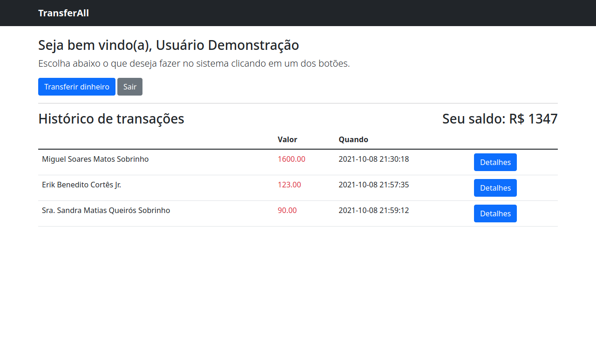

## TransferAll



## Instalação local ##

Execute `make install` para executar todos os passos necessários para a inicialização do projeto e dos containers. Após executar este comando, caso queira verificar a disponibilidade dos containers e se estão rodando, execute `make ps`.

No meu caso estou utilizando o **Caddy** para gerenciar meus projetos sem precisar expor as portas utilizando o docker, então adicionei uma nova regra no arquivo de configuração do **Caddy** e especifiquei como proxy reverso:

```
desafio.local.dev {
  import static
  import tls
  reverse_proxy desafio-nginx:80
}
```

Caso prefira expor as portas, base adicionar no arquivo `.env` do projeto as seguintes linhas:

```
DOCKER_NGINX_PORT=8081
DOCKER_DB_PORT=3306
```

### Usuário de demonstração ###

**Login:** `demo@demo.com.br`\
**Senha:** `123456`

---

## Instalação em produção ##

Certifique-se que no seu arquivo `.env` esteja presente:

```
APP_ENV=production
APP_DEBUG=false
```

Após isso, basta executar `make build` para criar as imagens necessárias. Este comando irá criar duas imagens prontas para produção: uma para o PHP e outra para o NGIX.

As imagens criadas estarão disponíveis com a tag `prod`:

| Repository  | TAG | SIZE |
| ------------- | ------------- | ------------- |
| desafio-nginx  | prod  | 22.9MB
| desafio-php  | prod  | 205MB

## Inspecionando o banco de dados ##

Para se conectar ao banco de dados basta executar na raiz do projeto:

```make connect-db```

que o console do MySQL irá abrir em seu terminal pronto para ser utilizado.

---

## Endpoints

### Listar todas as transações

#### Request

`GET /api/transactions`

    curl -i -H 'Accept: application/json' http://localhost/api/transactions

#### Response

```json
{
    "data": [
        {
            "id": 1,
            "wallet_payer_id": 2,
            "wallet_payee_id": 3,
            "from_name": "Usuário Demonstração",
            "to_name": "Miguel Soares Matos Sobrinho",
            "ammount": "1600.00",
            "created_at": "2021-10-09T01:30:18.000000Z",
            "updated_at": "2021-10-09T01:30:18.000000Z"
        }
    ]
}
```

### Detalhes de uma transação

#### Request

`GET /api/transactions/{id}`

    curl -i -H 'Accept: application/json' http://localhost/api/transactions/1

#### Response

```json
{
    "data": {
        "id": 1,
        "wallet_payer_id": 2,
        "wallet_payee_id": 3,
        "from_name": "Usuário Demonstração",
        "to_name": "Miguel Soares Matos Sobrinho",
        "ammount": "1600.00",
        "created_at": "2021-10-09T01:30:18.000000Z",
        "updated_at": "2021-10-09T01:30:18.000000Z"
    }
}
```

### Transferir dinheiro

#### Request

`POST /api/transactions`

    curl -i -H 'Accept: application/json' -X POST -d 'wallet_payer_id=1&wallet_payee_id=2&ammount=1200' http://localhost/api/transactions

#### Payload

```json
{
    "wallet_payer_id": 1,
    "wallet_payee_id": 2,
    "ammount": 1200
}
```

#### Response

```json
{
    "data": [
        {
            "id": 1,
            "wallet_payer_id": 1,
            "wallet_payee_id": 2,
            "from_name": "Usuário Demonstração",
            "to_name": "Miguel Soares Matos Sobrinho",
            "ammount": "1200.00",
            "created_at": "2021-10-09T01:30:18.000000Z",
            "updated_at": "2021-10-09T01:30:18.000000Z"
        }
    ]
}
```

### Detalhes de um usuário

#### Request

`GET /api/users/{id?}`

    curl -i -H 'Accept: application/json' http://localhost/api/users/1

#### Response

```json
{
    "data": {
        "id": 1,
        "name": "Sra. Andressa Arruda Fernandes Filho",
        "email": "imontenegro@example.net",
        "balance": "8491.00",
        "created_at": "2021-10-09T01:24:39.000000Z",
        "updated_at": "2021-10-09T01:24:39.000000Z"
    }
}
```

---

### Observações ###

Em caso de dúvida em relação aos comandos basta digitar "make" na raiz do projeto e uma lista de comandos irá aparecer com suas explicações.
